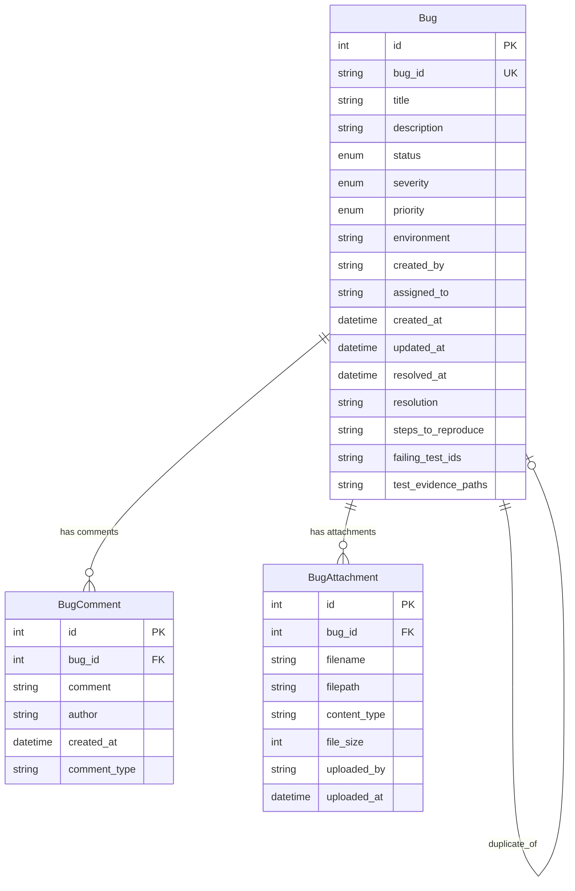

# FR-017 Bug Page - Design Specification

## Executive Summary

This document provides a comprehensive design for implementing a Bug Page system within the TTRPG Center admin interface. The system will track issues with status, severity, ownership, environment context, reproduction steps, and direct links to failing tests.

## System Architecture Overview

### Current System Integration Points

The Bug Page builds upon existing infrastructure:
- **Admin System**: Bootstrap-based admin interface (`templates/admin_dashboard.html`)
- **Testing Framework**: Existing `BugBundle` and `BugSeverity` classes in `src_common/admin/testing.py`
- **Database**: SQLModel-based models in `src_common/models.py`
- **Authentication**: JWT-based auth system for user assignment and ownership
- **Logging**: Structured logging via `src_common/logging.py`

## Database Schema Design

### Enhanced Bug Model

```python
# Extension to existing BugBundle dataclass in src_common/admin/testing.py

class BugStatus(str, Enum):
    """Bug status enumeration"""
    OPEN = "open"
    IN_PROGRESS = "in_progress"
    RESOLVED = "resolved"
    CLOSED = "closed"
    DUPLICATE = "duplicate"
    WONT_FIX = "wont_fix"

class BugPriority(str, Enum):
    """Bug priority enumeration"""
    LOW = "low"
    MEDIUM = "medium"
    HIGH = "high"
    URGENT = "urgent"

# SQLModel for persistent storage
class Bug(SQLModel, table=True):
    """Bug tracking entity"""
    __tablename__ = "bugs"

    # Primary identification
    id: Optional[int] = Field(default=None, primary_key=True)
    bug_id: str = Field(unique=True, index=True)  # UUID-based external ID

    # Basic information
    title: str = Field(max_length=200)
    description: str

    # Status and priority
    status: BugStatus = Field(default=BugStatus.OPEN)
    severity: BugSeverity = Field(default=BugSeverity.MEDIUM)
    priority: BugPriority = Field(default=BugPriority.MEDIUM)

    # Environment and context
    environment: str = Field(max_length=20)  # dev, test, prod
    component: Optional[str] = Field(max_length=100, default=None)
    version: Optional[str] = Field(max_length=50, default=None)

    # Ownership and assignment
    created_by: str = Field(max_length=100)
    assigned_to: Optional[str] = Field(max_length=100, default=None)

    # Timestamps
    created_at: datetime = Field(default_factory=lambda: datetime.now(timezone.utc))
    updated_at: datetime = Field(default_factory=lambda: datetime.now(timezone.utc))
    resolved_at: Optional[datetime] = Field(default=None)
    closed_at: Optional[datetime] = Field(default=None)

    # Resolution information
    resolution: Optional[str] = Field(default=None)
    resolution_notes: Optional[str] = Field(default=None)

    # Reproduction and testing
    steps_to_reproduce: Optional[str] = Field(default=None)
    expected_behavior: Optional[str] = Field(default=None)
    actual_behavior: Optional[str] = Field(default=None)

    # Test integration
    failing_test_ids: Optional[str] = Field(default=None)  # JSON array of test IDs
    test_evidence_paths: Optional[str] = Field(default=None)  # JSON array of file paths

    # Metadata
    tags: Optional[str] = Field(default=None)  # JSON array
    duplicate_of: Optional[int] = Field(default=None, foreign_key="bugs.id")

    # Indexes
    __table_args__ = (
        Index('idx_bug_status_env', 'status', 'environment'),
        Index('idx_bug_assigned', 'assigned_to'),
        Index('idx_bug_severity', 'severity'),
        Index('idx_bug_created', 'created_at'),
    )

class BugComment(SQLModel, table=True):
    """Bug comments for activity tracking"""
    __tablename__ = "bug_comments"

    id: Optional[int] = Field(default=None, primary_key=True)
    bug_id: int = Field(foreign_key="bugs.id")

    comment: str
    author: str = Field(max_length=100)
    created_at: datetime = Field(default_factory=lambda: datetime.now(timezone.utc))

    # Comment type for system vs user comments
    comment_type: str = Field(default="user")  # user, system, status_change

class BugAttachment(SQLModel, table=True):
    """Bug attachments for evidence"""
    __tablename__ = "bug_attachments"

    id: Optional[int] = Field(default=None, primary_key=True)
    bug_id: int = Field(foreign_key="bugs.id")

    filename: str = Field(max_length=255)
    filepath: str = Field(max_length=500)
    content_type: str = Field(max_length=100)
    file_size: int

    uploaded_by: str = Field(max_length=100)
    uploaded_at: datetime = Field(default_factory=lambda: datetime.now(timezone.utc))
```

### Database Relationships



## API Design Specification

### REST Endpoints

```python
# Bug Management API Routes (extend src_common/admin_routes.py)

# List and filter bugs
GET /api/admin/bugs
Query Parameters:
- status: BugStatus (optional)
- severity: BugSeverity (optional)
- environment: str (optional)
- assigned_to: str (optional)
- created_by: str (optional)
- tags: str (optional, comma-separated)
- limit: int (default: 50)
- offset: int (default: 0)
- sort: str (default: "-created_at")

Response:
{
    "bugs": [Bug],
    "total": int,
    "limit": int,
    "offset": int
}

# Create new bug
POST /api/admin/bugs
Body: BugCreateRequest
{
    "title": str,
    "description": str,
    "severity": BugSeverity,
    "priority": BugPriority,
    "environment": str,
    "component": str?,
    "steps_to_reproduce": str?,
    "expected_behavior": str?,
    "actual_behavior": str?,
    "failing_test_ids": [str]?,
    "tags": [str]?
}

# Get bug details
GET /api/admin/bugs/{bug_id}

# Update bug
PUT /api/admin/bugs/{bug_id}
Body: BugUpdateRequest (partial fields allowed)

# Delete bug (soft delete)
DELETE /api/admin/bugs/{bug_id}

# Bug status transitions
POST /api/admin/bugs/{bug_id}/assign
Body: {"assigned_to": str}

POST /api/admin/bugs/{bug_id}/resolve
Body: {"resolution": str, "resolution_notes": str?}

POST /api/admin/bugs/{bug_id}/close
Body: {"close_reason": str?}

POST /api/admin/bugs/{bug_id}/reopen
Body: {"reopen_reason": str?}

# Comments
GET /api/admin/bugs/{bug_id}/comments
POST /api/admin/bugs/{bug_id}/comments
Body: {"comment": str}

# Attachments
GET /api/admin/bugs/{bug_id}/attachments
POST /api/admin/bugs/{bug_id}/attachments
Content-Type: multipart/form-data

# Test integration
POST /api/admin/bugs/from-test-failure
Body: TestFailureContext
{
    "test_id": str,
    "test_name": str,
    "failure_output": str,
    "environment": str,
    "test_type": str,
    "evidence_files": [str]
}

# Analytics
GET /api/admin/bugs/stats
Response:
{
    "total_bugs": int,
    "open_bugs": int,
    "by_severity": {"low": int, "medium": int, ...},
    "by_environment": {"dev": int, "test": int, ...},
    "resolution_time_avg": float
}
```

### Service Layer Design

```python
# src_common/admin/bug_service.py

class BugService:
    """Bug management service"""

    def __init__(self, db_session: Session):
        self.db = db_session
        self.logger = get_logger(__name__)

    async def create_bug_from_test_failure(
        self,
        test_context: TestFailureContext,
        created_by: str
    ) -> Bug:
        """AC1: Bug creation from Testing carries over failure context"""

        bug = Bug(
            bug_id=f"BUG-{uuid.uuid4().hex[:8].upper()}",
            title=f"Test Failure: {test_context.test_name}",
            description=self._format_test_failure_description(test_context),
            severity=self._infer_severity_from_test(test_context),
            environment=test_context.environment,
            component=self._infer_component_from_test(test_context),
            created_by=created_by,
            steps_to_reproduce=self._format_reproduction_steps(test_context),
            failing_test_ids=json.dumps([test_context.test_id]),
            test_evidence_paths=json.dumps(test_context.evidence_files)
        )

        self.db.add(bug)
        await self.db.commit()

        # Add initial system comment
        await self._add_system_comment(
            bug.id,
            f"Bug created from failed test: {test_context.test_id}"
        )

        return bug

    async def list_bugs(
        self,
        filters: BugFilters,
        user_id: str
    ) -> PaginatedBugResponse:
        """AC2: Filters by status/severity/assignee"""

        query = select(Bug)

        # Apply filters
        if filters.status:
            query = query.where(Bug.status == filters.status)
        if filters.severity:
            query = query.where(Bug.severity == filters.severity)
        if filters.assigned_to:
            query = query.where(Bug.assigned_to == filters.assigned_to)
        if filters.environment:
            query = query.where(Bug.environment == filters.environment)
        if filters.created_by:
            query = query.where(Bug.created_by == filters.created_by)

        # Tag filtering (JSON search)
        if filters.tags:
            for tag in filters.tags:
                query = query.where(Bug.tags.contains(f'"{tag}"'))

        # Sorting
        if filters.sort.startswith('-'):
            sort_field = getattr(Bug, filters.sort[1:])
            query = query.order_by(sort_field.desc())
        else:
            sort_field = getattr(Bug, filters.sort)
            query = query.order_by(sort_field.asc())

        # Pagination
        total = await self.db.scalar(select(func.count()).select_from(query.subquery()))
        bugs = await self.db.scalars(
            query.limit(filters.limit).offset(filters.offset)
        ).all()

        return PaginatedBugResponse(
            bugs=bugs,
            total=total,
            limit=filters.limit,
            offset=filters.offset
        )
```

## User Interface Design

### Admin Dashboard Integration

The bug page integrates into the existing admin navigation:

```html
<!-- Extension to templates/base.html navigation -->
<li class="nav-item">
    <a class="nav-link active"
       href="/admin/bugs">
        <i class="bi bi-bug me-2"></i>Bug Tracking
    </a>
</li>
```

### Bug List Page Layout

```html
<!-- templates/admin/bugs.html -->


Bug Tracking - TTRPG Center Admin


<div class="d-flex justify-content-between align-items-center mb-4">
    <h1 class="h3 mb-0">
        <i class="bi bi-bug me-2"></i>Bug Tracking
    </h1>
    <div class="btn-group">
        <button type="button" class="btn btn-admin" data-bs-toggle="modal" data-bs-target="#createBugModal">
            <i class="bi bi-plus-circle me-1"></i>New Bug
        </button>
        <button type="button" class="btn btn-outline-admin" onclick="refreshBugList()">
            <i class="bi bi-arrow-clockwise me-1"></i>Refresh
        </button>
    </div>
</div>

<!-- Filter Panel -->
<div class="card mb-4">
    <div class="card-body">
        <div class="row g-3" id="bug-filters">
            <div class="col-md-2">
                <label class="form-label">Status</label>
                <select class="form-select" id="filter-status">
                    <option value="">All Status</option>
                    <option value="open">Open</option>
                    <option value="in_progress">In Progress</option>
                    <option value="resolved">Resolved</option>
                    <option value="closed">Closed</option>
                </select>
            </div>
            <div class="col-md-2">
                <label class="form-label">Severity</label>
                <select class="form-select" id="filter-severity">
                    <option value="">All Severity</option>
                    <option value="low">Low</option>
                    <option value="medium">Medium</option>
                    <option value="high">High</option>
                    <option value="critical">Critical</option>
                </select>
            </div>
            <div class="col-md-2">
                <label class="form-label">Environment</label>
                <select class="form-select" id="filter-environment">
                    <option value="">All Environments</option>
                    <option value="dev">Development</option>
                    <option value="test">Testing</option>
                    <option value="prod">Production</option>
                </select>
            </div>
            <div class="col-md-3">
                <label class="form-label">Assigned To</label>
                <select class="form-select" id="filter-assignee">
                    <option value="">All Assignees</option>
                    <option value="me">Assigned to Me</option>
                    <!-- Dynamic user options -->
                </select>
            </div>
            <div class="col-md-3">
                <label class="form-label">Search</label>
                <input type="text" class="form-control" id="filter-search"
                       placeholder="Search title, description...">
            </div>
        </div>
    </div>
</div>

<!-- Bug List Table -->
<div class="card">
    <div class="card-body">
        <div class="table-responsive">
            <table class="table table-hover" id="bugs-table">
                <thead>
                    <tr>
                        <th>ID</th>
                        <th>Title</th>
                        <th>Status</th>
                        <th>Severity</th>
                        <th>Environment</th>
                        <th>Assigned To</th>
                        <th>Created</th>
                        <th>Actions</th>
                    </tr>
                </thead>
                <tbody id="bugs-table-body">
                    <!-- Dynamic content -->
                </tbody>
            </table>
        </div>

        <!-- Pagination -->
        <nav aria-label="Bug list pagination" id="bug-pagination">
            <ul class="pagination justify-content-center">
                <!-- Dynamic pagination -->
            </ul>
        </nav>
    </div>
</div>

```

### Bug Detail/Edit Modal

```html
<!-- Bug Detail Modal -->
<div class="modal fade" id="bugDetailModal" tabindex="-1">
    <div class="modal-dialog modal-xl">
        <div class="modal-content">
            <div class="modal-header">
                <h5 class="modal-title">
                    <span id="modal-bug-id"></span>: <span id="modal-bug-title"></span>
                </h5>
                <button type="button" class="btn-close" data-bs-dismiss="modal"></button>
            </div>

            <div class="modal-body">
                <div class="row">
                    <!-- Left Column: Bug Details -->
                    <div class="col-md-8">
                        <form id="bug-edit-form">
                            <!-- Basic Information -->
                            <div class="mb-3">
                                <label class="form-label">Title</label>
                                <input type="text" class="form-control" id="edit-title" name="title">
                            </div>

                            <div class="mb-3">
                                <label class="form-label">Description</label>
                                <textarea class="form-control" rows="4" id="edit-description" name="description"></textarea>
                            </div>

                            <!-- Status and Priority -->
                            <div class="row mb-3">
                                <div class="col-md-3">
                                    <label class="form-label">Status</label>
                                    <select class="form-select" id="edit-status" name="status">
                                        <option value="open">Open</option>
                                        <option value="in_progress">In Progress</option>
                                        <option value="resolved">Resolved</option>
                                        <option value="closed">Closed</option>
                                    </select>
                                </div>
                                <div class="col-md-3">
                                    <label class="form-label">Severity</label>
                                    <select class="form-select" id="edit-severity" name="severity">
                                        <option value="low">Low</option>
                                        <option value="medium">Medium</option>
                                        <option value="high">High</option>
                                        <option value="critical">Critical</option>
                                    </select>
                                </div>
                                <div class="col-md-3">
                                    <label class="form-label">Priority</label>
                                    <select class="form-select" id="edit-priority" name="priority">
                                        <option value="low">Low</option>
                                        <option value="medium">Medium</option>
                                        <option value="high">High</option>
                                        <option value="urgent">Urgent</option>
                                    </select>
                                </div>
                                <div class="col-md-3">
                                    <label class="form-label">Environment</label>
                                    <select class="form-select" id="edit-environment" name="environment">
                                        <option value="dev">Development</option>
                                        <option value="test">Testing</option>
                                        <option value="prod">Production</option>
                                    </select>
                                </div>
                            </div>

                            <!-- Assignment -->
                            <div class="mb-3">
                                <label class="form-label">Assigned To</label>
                                <select class="form-select" id="edit-assigned-to" name="assigned_to">
                                    <option value="">Unassigned</option>
                                    <!-- Dynamic user options -->
                                </select>
                            </div>

                            <!-- Reproduction Steps -->
                            <div class="mb-3">
                                <label class="form-label">Steps to Reproduce</label>
                                <textarea class="form-control" rows="4" id="edit-reproduction" name="steps_to_reproduce"></textarea>
                            </div>

                            <!-- Expected vs Actual Behavior -->
                            <div class="row mb-3">
                                <div class="col-md-6">
                                    <label class="form-label">Expected Behavior</label>
                                    <textarea class="form-control" rows="3" id="edit-expected" name="expected_behavior"></textarea>
                                </div>
                                <div class="col-md-6">
                                    <label class="form-label">Actual Behavior</label>
                                    <textarea class="form-control" rows="3" id="edit-actual" name="actual_behavior"></textarea>
                                </div>
                            </div>
                        </form>

                        <!-- Failed Tests Section -->
                        <div class="mb-4" id="failed-tests-section">
                            <h6>Linked Failed Tests</h6>
                            <div id="failed-tests-list">
                                <!-- Dynamic test links -->
                            </div>
                        </div>

                        <!-- Comments Section -->
                        <div class="mb-4">
                            <h6>Activity & Comments</h6>
                            <div id="bug-comments" class="border rounded p-3 mb-3" style="max-height: 300px; overflow-y: auto;">
                                <!-- Dynamic comments -->
                            </div>
                            <div class="input-group">
                                <input type="text" class="form-control" id="new-comment" placeholder="Add a comment...">
                                <button class="btn btn-admin" type="button" onclick="addComment()">
                                    <i class="bi bi-send"></i>
                                </button>
                            </div>
                        </div>
                    </div>

                    <!-- Right Column: Metadata & Attachments -->
                    <div class="col-md-4">
                        <!-- Metadata Panel -->
                        <div class="card mb-3">
                            <div class="card-header">
                                <h6 class="mb-0">Metadata</h6>
                            </div>
                            <div class="card-body">
                                <div class="mb-2">
                                    <small class="text-muted">Created:</small><br>
                                    <span id="meta-created"></span>
                                </div>
                                <div class="mb-2">
                                    <small class="text-muted">Created By:</small><br>
                                    <span id="meta-created-by"></span>
                                </div>
                                <div class="mb-2">
                                    <small class="text-muted">Last Updated:</small><br>
                                    <span id="meta-updated"></span>
                                </div>
                                <div class="mb-2" id="meta-resolved-section" style="display: none;">
                                    <small class="text-muted">Resolved:</small><br>
                                    <span id="meta-resolved"></span>
                                </div>
                            </div>
                        </div>

                        <!-- Attachments Panel -->
                        <div class="card mb-3">
                            <div class="card-header d-flex justify-content-between align-items-center">
                                <h6 class="mb-0">Attachments</h6>
                                <button class="btn btn-sm btn-outline-admin" onclick="triggerFileUpload()">
                                    <i class="bi bi-plus-circle"></i>
                                </button>
                            </div>
                            <div class="card-body">
                                <div id="attachments-list">
                                    <!-- Dynamic attachments -->
                                </div>
                                <input type="file" id="file-upload" multiple style="display: none;" onchange="uploadFiles()">
                            </div>
                        </div>

                        <!-- Tags Panel -->
                        <div class="card">
                            <div class="card-header">
                                <h6 class="mb-0">Tags</h6>
                            </div>
                            <div class="card-body">
                                <div id="bug-tags">
                                    <!-- Dynamic tags -->
                                </div>
                                <div class="input-group input-group-sm mt-2">
                                    <input type="text" class="form-control" id="new-tag" placeholder="Add tag...">
                                    <button class="btn btn-admin" onclick="addTag()">
                                        <i class="bi bi-plus"></i>
                                    </button>
                                </div>
                            </div>
                        </div>
                    </div>
                </div>
            </div>

            <div class="modal-footer">
                <button type="button" class="btn btn-secondary" data-bs-dismiss="modal">Cancel</button>
                <button type="button" class="btn btn-admin" onclick="saveBugChanges()">Save Changes</button>
            </div>
        </div>
    </div>
</div>
```

### JavaScript Interface Logic

```javascript
// static/admin/js/bug-management.js

class BugManager {
    constructor() {
        this.currentFilters = {};
        this.currentPage = 0;
        this.pageSize = 25;
        this.init();
    }

    init() {
        this.loadBugList();
        this.setupEventHandlers();
        this.loadUserOptions();
    }

    setupEventHandlers() {
        // Filter changes
        ['filter-status', 'filter-severity', 'filter-environment', 'filter-assignee']
            .forEach(id => {
                document.getElementById(id).addEventListener('change', () => {
                    this.applyFilters();
                });
            });

        // Search with debounce
        const searchInput = document.getElementById('filter-search');
        let searchTimeout;
        searchInput.addEventListener('input', (e) => {
            clearTimeout(searchTimeout);
            searchTimeout = setTimeout(() => {
                this.applyFilters();
            }, 500);
        });

        // Status change handlers
        document.getElementById('edit-status').addEventListener('change', (e) => {
            this.handleStatusChange(e.target.value);
        });
    }

    async loadBugList() {
        try {
            const params = new URLSearchParams({
                ...this.currentFilters,
                limit: this.pageSize,
                offset: this.currentPage * this.pageSize
            });

            const response = await fetch(`/api/admin/bugs?${params}`);
            const data = await response.json();

            this.renderBugTable(data.bugs);
            this.renderPagination(data.total);
        } catch (error) {
            console.error('Failed to load bugs:', error);
            this.showError('Failed to load bug list');
        }
    }

    renderBugTable(bugs) {
        const tbody = document.getElementById('bugs-table-body');
        tbody.innerHTML = '';

        bugs.forEach(bug => {
            const row = document.createElement('tr');
            row.innerHTML = `
                <td>
                    <code class="bug-id">${bug.bug_id}</code>
                </td>
                <td>
                    <a href="#" onclick="bugManager.openBugModal('${bug.bug_id}')" class="text-decoration-none">
                        ${bug.title}
                    </a>
                </td>
                <td>
                    <span class="badge badge-status-${bug.status}">${this.formatStatus(bug.status)}</span>
                </td>
                <td>
                    <span class="badge badge-severity-${bug.severity}">${this.formatSeverity(bug.severity)}</span>
                </td>
                <td>
                    <span class="badge bg-secondary">${bug.environment.toUpperCase()}</span>
                </td>
                <td>
                    ${bug.assigned_to || '<span class="text-muted">Unassigned</span>'}
                </td>
                <td>
                    <small class="text-muted">${this.formatDate(bug.created_at)}</small>
                </td>
                <td>
                    <div class="btn-group btn-group-sm">
                        <button class="btn btn-outline-primary btn-sm" onclick="bugManager.openBugModal('${bug.bug_id}')">
                            <i class="bi bi-eye"></i>
                        </button>
                        <button class="btn btn-outline-success btn-sm" onclick="bugManager.assignToMe('${bug.bug_id}')"
                                title="Assign to me">
                            <i class="bi bi-person-check"></i>
                        </button>
                    </div>
                </td>
            `;
            tbody.appendChild(row);
        });
    }

    async openBugModal(bugId) {
        try {
            const response = await fetch(`/api/admin/bugs/${bugId}`);
            const bug = await response.json();

            // Populate modal fields
            this.populateBugModal(bug);

            // Load comments and attachments
            await Promise.all([
                this.loadBugComments(bugId),
                this.loadBugAttachments(bugId)
            ]);

            // Show modal
            const modal = new bootstrap.Modal(document.getElementById('bugDetailModal'));
            modal.show();

        } catch (error) {
            console.error('Failed to load bug details:', error);
            this.showError('Failed to load bug details');
        }
    }

    populateBugModal(bug) {
        // Basic fields
        document.getElementById('modal-bug-id').textContent = bug.bug_id;
        document.getElementById('modal-bug-title').textContent = bug.title;
        document.getElementById('edit-title').value = bug.title;
        document.getElementById('edit-description').value = bug.description || '';

        // Status and priority
        document.getElementById('edit-status').value = bug.status;
        document.getElementById('edit-severity').value = bug.severity;
        document.getElementById('edit-priority').value = bug.priority || 'medium';
        document.getElementById('edit-environment').value = bug.environment;

        // Assignment
        document.getElementById('edit-assigned-to').value = bug.assigned_to || '';

        // Reproduction details
        document.getElementById('edit-reproduction').value = bug.steps_to_reproduce || '';
        document.getElementById('edit-expected').value = bug.expected_behavior || '';
        document.getElementById('edit-actual').value = bug.actual_behavior || '';

        // Metadata
        document.getElementById('meta-created').textContent = this.formatDate(bug.created_at);
        document.getElementById('meta-created-by').textContent = bug.created_by;
        document.getElementById('meta-updated').textContent = this.formatDate(bug.updated_at);

        if (bug.resolved_at) {
            document.getElementById('meta-resolved').textContent = this.formatDate(bug.resolved_at);
            document.getElementById('meta-resolved-section').style.display = 'block';
        }

        // Failed tests
        this.renderFailedTests(JSON.parse(bug.failing_test_ids || '[]'));

        // Store current bug for saving
        this.currentBug = bug;
    }

    renderFailedTests(testIds) {
        const container = document.getElementById('failed-tests-list');
        if (testIds.length === 0) {
            container.innerHTML = '<em class="text-muted">No linked test failures</em>';
            return;
        }

        container.innerHTML = testIds.map(testId => `
            <div class="d-flex justify-content-between align-items-center mb-2">
                <code class="test-id">${testId}</code>
                <button class="btn btn-sm btn-outline-primary" onclick="viewTestResults('${testId}')">
                    <i class="bi bi-play-circle me-1"></i>View Results
                </button>
            </div>
        `).join('');
    }

    async createBugFromTestFailure(testContext) {
        """AC1 Implementation: Bug creation from Testing with failure context"""
        try {
            const response = await fetch('/api/admin/bugs/from-test-failure', {
                method: 'POST',
                headers: {'Content-Type': 'application/json'},
                body: JSON.stringify(testContext)
            });

            const bug = await response.json();
            await this.loadBugList(); // Refresh list
            await this.openBugModal(bug.bug_id); // Show created bug

        } catch (error) {
            console.error('Failed to create bug from test failure:', error);
            this.showError('Failed to create bug from test failure');
        }
    }
}

// Initialize bug manager
const bugManager = new BugManager();
```

## Integration Points

### Test Framework Integration

```python
# Integration with existing testing system for AC1
# Extension to src_common/admin/testing.py

class TestingService:
    async def handle_test_failure(self, test_result: TestResult):
        """Automatically create bug when tests fail"""

        if test_result.status == TestStatus.FAILED:
            # Check if bug already exists for this test
            existing_bug = await self.bug_service.find_bug_by_test_id(test_result.test_id)

            if not existing_bug:
                # Create new bug from test failure
                test_context = TestFailureContext(
                    test_id=test_result.test_id,
                    test_name=test_result.name,
                    failure_output=test_result.error_message,
                    environment=test_result.environment,
                    test_type=test_result.test_type,
                    evidence_files=test_result.log_files
                )

                await self.bug_service.create_bug_from_test_failure(
                    test_context,
                    "system"  # System-created bug
                )
```

### Navigation Integration

```python
# Extension to src_common/admin_routes.py

@router.get("/bugs", response_class=HTMLResponse)
async def bugs_page(request: Request, current_user = Depends(get_current_user)):
    """Bug tracking page"""
    return templates.TemplateResponse(
        "admin/bugs.html",
        {
            "request": request,
            "active_nav": "bugs",
            "user": current_user
        }
    )

@router.get("/api/bugs")
async def list_bugs(
    status: Optional[BugStatus] = None,
    severity: Optional[BugSeverity] = None,
    environment: Optional[str] = None,
    assigned_to: Optional[str] = None,
    limit: int = Query(50, le=100),
    offset: int = Query(0, ge=0),
    current_user = Depends(get_current_user)
):
    """AC2: List bugs with filtering by status/severity/assignee"""

    filters = BugFilters(
        status=status,
        severity=severity,
        environment=environment,
        assigned_to=assigned_to,
        limit=limit,
        offset=offset
    )

    bug_service = BugService(db_session)
    return await bug_service.list_bugs(filters, current_user.username)
```

## Implementation Roadmap

### Phase 1: Database & Models (2 days)
- [ ] Extend `models.py` with Bug, BugComment, BugAttachment models
- [ ] Create database migration script
- [ ] Implement BugService core functionality
- [ ] Unit tests for service layer

### Phase 2: API Endpoints (3 days)
- [ ] Implement bug CRUD endpoints
- [ ] Add filtering and pagination logic
- [ ] Implement test failure integration endpoint
- [ ] API integration tests

### Phase 3: UI Implementation (4 days)
- [ ] Create bug list page template
- [ ] Implement bug detail/edit modal
- [ ] Add JavaScript interaction logic
- [ ] Style with existing admin theme

### Phase 4: Integration & Testing (2 days)
- [ ] Integrate with existing test framework
- [ ] Add navigation menu items
- [ ] End-to-end functional tests
- [ ] User acceptance testing

## Success Criteria Validation

### AC1: Bug creation from Testing carries over failure context
- ✅ `create_bug_from_test_failure()` API endpoint
- ✅ Auto-population of test ID, failure output, environment
- ✅ Evidence file attachment linking
- ✅ Structured reproduction steps from test context

### AC2: Filters by status/severity/assignee
- ✅ Multi-criteria filter interface
- ✅ Backend query optimization with indexes
- ✅ Real-time filter application
- ✅ Efficient pagination for large result sets

## Security Considerations

- **Authentication**: All bug operations require valid JWT token
- **Authorization**: Role-based access (admin users only)
- **Input Validation**: SQLModel validation on all inputs
- **File Upload Security**: Content-type validation, file size limits
- **SQL Injection Prevention**: Parameterized queries via SQLModel

## Performance Considerations

- **Database Indexes**: Strategic indexes on filter columns
- **Pagination**: Efficient offset-based pagination
- **Caching**: Redis caching for user lists and metadata
- **File Storage**: Separate storage service for attachments
- **Search**: Future: Full-text search with PostgreSQL or Elasticsearch

## Monitoring & Analytics

- **Metrics**: Bug creation rate, resolution time, severity distribution
- **Logging**: Structured logs for all bug operations
- **Alerting**: Critical bug notifications
- **Reports**: Weekly/monthly bug statistics dashboards

This design specification provides a comprehensive foundation for implementing FR-017 Bug Page with all required acceptance criteria and seamless integration into the existing TTRPG Center admin system.