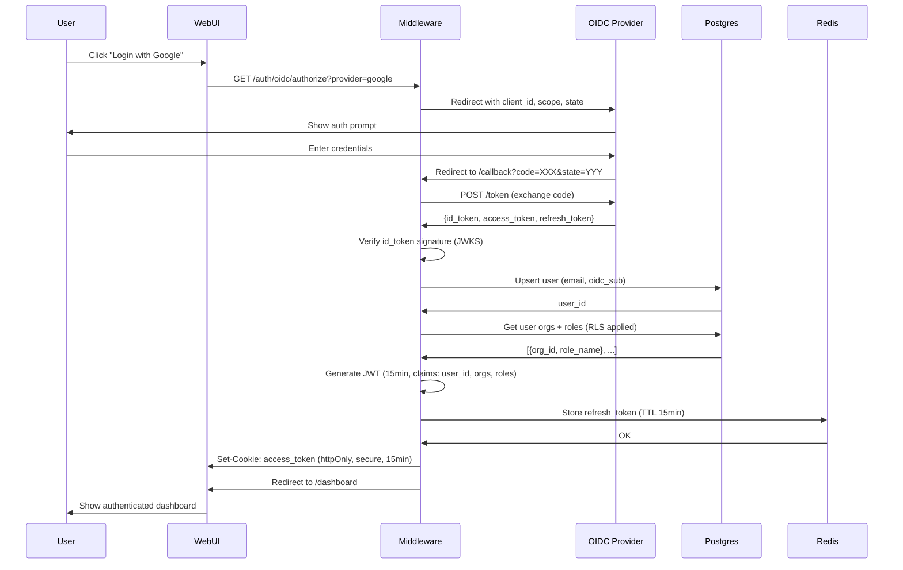
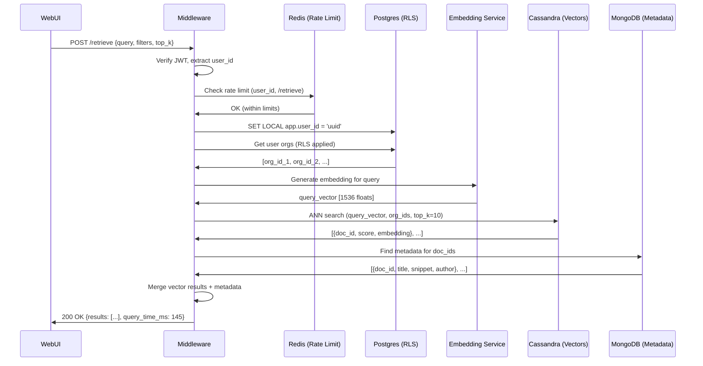
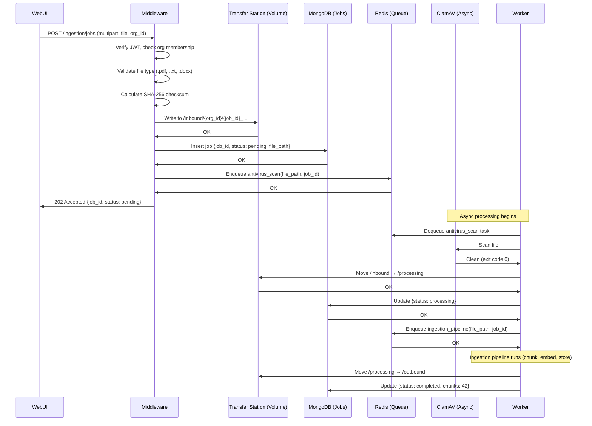

# Detailed Technical Design – Middleware API & Services
**Version:** 1.0
**Date:** October 19, 2025
**Reference:** P01 Middleware Plan, P02 DB Design RBAC

---

## Executive Summary

This document provides the complete technical design for the FastAPI middleware layer, covering all API endpoints, error handling, database access patterns, security mechanisms, observability, and integration strategies. The design ensures implementation teams can build the system without ambiguity.

**Key Components:**
- 20+ RESTful API endpoints with OpenAPI 3.1 schemas
- JWT-based authentication with 15-minute expiry + refresh token rotation
- Multi-database access with connection pooling, retries, circuit breakers
- Row-Level Security (RLS) context propagation
- Distributed rate limiting with Redis
- OpenTelemetry tracing + Prometheus metrics
- Comprehensive security headers & CORS policies

---

## Table of Contents

1. [API Endpoint Contracts](#1-api-endpoint-contracts)
2. [Error Taxonomy](#2-error-taxonomy)
3. [Database Access Patterns](#3-database-access-patterns)
4. [Token Model & Authentication](#4-token-model--authentication)
5. [Rate Limiting](#5-rate-limiting)
6. [Observability](#6-observability)
7. [Security Headers & CORS](#7-security-headers--cors)
8. [Transfer Station File I/O](#8-transfer-station-file-io)
9. [Query Strategies](#9-query-strategies)
10. [Sequence Diagrams](#10-sequence-diagrams)

---

## 1. API Endpoint Contracts

### 1.1 OpenAPI Schema Overview

**Base URL:** `https://api.ttrpg.dev/v1`
**Content-Type:** `application/json`
**Authentication:** JWT Bearer token (in `Authorization: Bearer <token>` header or httpOnly cookie)

### 1.2 Authentication Endpoints (`/auth/*`)

#### POST /auth/oidc/authorize

Initiate OIDC authentication flow.

**Request:**
```yaml
parameters:
  - name: provider
    in: query
    required: true
    schema:
      type: string
      enum: [google, github, auth0]
  - name: redirect_uri
    in: query
    required: true
    schema:
      type: string
      format: uri

responses:
  302:
    description: Redirect to OIDC provider
    headers:
      Location:
        schema:
          type: string
          example: "https://accounts.google.com/o/oauth2/v2/auth?client_id=..."
```

---

#### GET /auth/oidc/callback

Handle OIDC callback and exchange authorization code for tokens.

**Request:**
```yaml
parameters:
  - name: code
    in: query
    required: true
    schema:
      type: string
  - name: state
    in: query
    required: true
    schema:
      type: string

responses:
  302:
    description: Redirect to application with tokens set
    headers:
      Set-Cookie:
        schema:
          type: string
          example: "access_token=eyJ...; HttpOnly; Secure; SameSite=Strict; Max-Age=900"
      Location:
        schema:
          type: string
          example: "https://app.ttrpg.dev/dashboard"

  400:
    $ref: '#/components/responses/BadRequest'

  401:
    $ref: '#/components/responses/Unauthorized'
```

---

#### POST /auth/refresh

Rotate refresh token and issue new JWT access token.

**Request:**
```yaml
requestBody:
  required: true
  content:
    application/json:
      schema:
        type: object
        properties:
          refresh_token:
            type: string
            format: uuid
        required:
          - refresh_token

responses:
  200:
    description: New tokens issued
    content:
      application/json:
        schema:
          type: object
          properties:
            access_token:
              type: string
              example: "eyJhbGciOiJSUzI1NiIsInR5cCI6IkpXVCJ9..."
            refresh_token:
              type: string
              format: uuid
            expires_in:
              type: integer
              example: 900
              description: "Access token expiry in seconds (15 minutes)"

  401:
    $ref: '#/components/responses/Unauthorized'
    description: Invalid or expired refresh token
```

---

#### POST /auth/logout

Revoke refresh token and invalidate session.

**Request:**
```yaml
requestBody:
  required: true
  content:
    application/json:
      schema:
        type: object
        properties:
          refresh_token:
            type: string
            format: uuid
        required:
          - refresh_token

responses:
  204:
    description: Successfully logged out

  401:
    $ref: '#/components/responses/Unauthorized'
```

---

### 1.3 User & Organization Endpoints

#### GET /me

Get current user profile with organizations and roles.

**Request:**
```yaml
security:
  - BearerAuth: []

responses:
  200:
    description: User profile
    content:
      application/json:
        schema:
          type: object
          properties:
            id:
              type: string
              format: uuid
            email:
              type: string
              format: email
            display_name:
              type: string
            avatar_url:
              type: string
              format: uri
            organizations:
              type: array
              items:
                type: object
                properties:
                  org_id:
                    type: string
                    format: uuid
                  org_name:
                    type: string
                  org_slug:
                    type: string
                  roles:
                    type: array
                    items:
                      type: string
                      enum: [admin, editor, viewer]

  401:
    $ref: '#/components/responses/Unauthorized'
```

---

#### GET /orgs

List organizations for authenticated user.

**Request:**
```yaml
security:
  - BearerAuth: []

parameters:
  - name: page
    in: query
    schema:
      type: integer
      default: 1
  - name: limit
    in: query
    schema:
      type: integer
      default: 20
      maximum: 100

responses:
  200:
    description: List of organizations
    content:
      application/json:
        schema:
          type: object
          properties:
            data:
              type: array
              items:
                $ref: '#/components/schemas/Organization'
            pagination:
              $ref: '#/components/schemas/Pagination'

  401:
    $ref: '#/components/responses/Unauthorized'
```

---

#### POST /orgs

Create a new organization (user becomes admin).

**Request:**
```yaml
security:
  - BearerAuth: []

requestBody:
  required: true
  content:
    application/json:
      schema:
        type: object
        properties:
          name:
            type: string
            minLength: 3
            maxLength: 100
          slug:
            type: string
            pattern: '^[a-z0-9-]+$'
            minLength: 3
            maxLength: 50
        required:
          - name
          - slug

responses:
  201:
    description: Organization created
    content:
      application/json:
        schema:
          $ref: '#/components/schemas/Organization'

  400:
    $ref: '#/components/responses/BadRequest'

  409:
    $ref: '#/components/responses/Conflict'
    description: Organization name or slug already exists
```

---

### 1.4 Data Endpoints

#### POST /retrieve

Perform vector similarity search with metadata filtering.

**Request:**
```yaml
security:
  - BearerAuth: []

requestBody:
  required: true
  content:
    application/json:
      schema:
        type: object
        properties:
          query:
            type: string
            minLength: 1
            maxLength: 1000
          filters:
            type: object
            properties:
              org_ids:
                type: array
                items:
                  type: string
                  format: uuid
              source_ids:
                type: array
                items:
                  type: string
              date_range:
                type: object
                properties:
                  start:
                    type: string
                    format: date-time
                  end:
                    type: string
                    format: date-time
          top_k:
            type: integer
            default: 10
            minimum: 1
            maximum: 100
        required:
          - query

responses:
  200:
    description: Search results
    content:
      application/json:
        schema:
          type: object
          properties:
            results:
              type: array
              items:
                type: object
                properties:
                  id:
                    type: string
                    format: uuid
                  score:
                    type: number
                    format: float
                    minimum: 0
                    maximum: 1
                  title:
                    type: string
                  content_snippet:
                    type: string
                  metadata:
                    type: object
                    additionalProperties: true
            query_time_ms:
              type: integer
              description: "Query execution time in milliseconds"

  400:
    $ref: '#/components/responses/BadRequest'

  401:
    $ref: '#/components/responses/Unauthorized'
```

---

#### GET /dictionary/{term}

Retrieve term definition and relationships from knowledge graph.

**Request:**
```yaml
security:
  - BearerAuth: []

parameters:
  - name: term
    in: path
    required: true
    schema:
      type: string
  - name: org_id
    in: query
    required: true
    schema:
      type: string
      format: uuid
  - name: depth
    in: query
    schema:
      type: integer
      default: 1
      minimum: 1
      maximum: 3

responses:
  200:
    description: Term with relationships
    content:
      application/json:
        schema:
          type: object
          properties:
            term:
              type: string
            definition:
              type: string
            relationships:
              type: array
              items:
                type: object
                properties:
                  type:
                    type: string
                    enum: [synonym, antonym, hypernym, hyponym, related_to]
                  term:
                    type: string
                  definition:
                    type: string

  404:
    $ref: '#/components/responses/NotFound'
```

---

### 1.5 Ingestion Endpoints

#### POST /ingestion/jobs

Submit file for ingestion processing.

**Request:**
```yaml
security:
  - BearerAuth: []

requestBody:
  required: true
  content:
    multipart/form-data:
      schema:
        type: object
        properties:
          file:
            type: string
            format: binary
            description: "PDF, TXT, DOCX, or EPUB file"
          org_id:
            type: string
            format: uuid
          metadata:
            type: object
            additionalProperties: true
        required:
          - file
          - org_id

responses:
  202:
    description: Job accepted for processing
    content:
      application/json:
        schema:
          type: object
          properties:
            job_id:
              type: string
              format: uuid
            status:
              type: string
              enum: [pending]
            created_at:
              type: string
              format: date-time

  400:
    $ref: '#/components/responses/BadRequest'
    description: Invalid file type or size

  413:
    description: File too large (max 100MB)
```

---

#### GET /ingestion/jobs/{job_id}

Get ingestion job status and progress.

**Request:**
```yaml
security:
  - BearerAuth: []

parameters:
  - name: job_id
    in: path
    required: true
    schema:
      type: string
      format: uuid

responses:
  200:
    description: Job status
    content:
      application/json:
        schema:
          type: object
          properties:
            job_id:
              type: string
              format: uuid
            status:
              type: string
              enum: [pending, processing, completed, failed]
            progress:
              type: integer
              minimum: 0
              maximum: 100
            result:
              type: object
              properties:
                chunks_created:
                  type: integer
                vectors_stored:
                  type: integer
                error_message:
                  type: string
            created_at:
              type: string
              format: date-time
            updated_at:
              type: string
              format: date-time

  404:
    $ref: '#/components/responses/NotFound'
```

---

### 1.6 Audit & Observability Endpoints

#### GET /audit

Query audit logs (admin only, paginated).

**Request:**
```yaml
security:
  - BearerAuth: []

parameters:
  - name: org_id
    in: query
    required: true
    schema:
      type: string
      format: uuid
  - name: user_id
    in: query
    schema:
      type: string
      format: uuid
  - name: action
    in: query
    schema:
      type: string
  - name: resource_type
    in: query
    schema:
      type: string
  - name: start_date
    in: query
    schema:
      type: string
      format: date-time
  - name: end_date
    in: query
    schema:
      type: string
      format: date-time
  - name: page
    in: query
    schema:
      type: integer
      default: 1
  - name: limit
    in: query
    schema:
      type: integer
      default: 50
      maximum: 500

responses:
  200:
    description: Audit log entries
    content:
      application/json:
        schema:
          type: object
          properties:
            data:
              type: array
              items:
                type: object
                properties:
                  id:
                    type: string
                    format: uuid
                  user_id:
                    type: string
                    format: uuid
                  action:
                    type: string
                  resource_type:
                    type: string
                  resource_id:
                    type: string
                    format: uuid
                  changes:
                    type: object
                  ip_address:
                    type: string
                  created_at:
                    type: string
                    format: date-time
            pagination:
              $ref: '#/components/schemas/Pagination'

  403:
    $ref: '#/components/responses/Forbidden'
    description: User is not admin in this org
```

---

#### GET /health/live

Liveness probe (responds if process is running).

**Request:**
```yaml
responses:
  200:
    description: Service is alive
    content:
      application/json:
        schema:
          type: object
          properties:
            status:
              type: string
              enum: [ok]
            timestamp:
              type: string
              format: date-time
```

---

#### GET /health/ready

Readiness probe (checks database connections).

**Request:**
```yaml
responses:
  200:
    description: Service is ready
    content:
      application/json:
        schema:
          type: object
          properties:
            status:
              type: string
              enum: [ok]
            checks:
              type: object
              properties:
                postgres:
                  type: string
                  enum: [ok, degraded]
                redis:
                  type: string
                  enum: [ok, degraded]
                cassandra:
                  type: string
                  enum: [ok, degraded]
                mongodb:
                  type: string
                  enum: [ok, degraded]
                neo4j:
                  type: string
                  enum: [ok, degraded]

  503:
    description: Service not ready
```

---

#### GET /metrics

Prometheus metrics exposition endpoint.

**Request:**
```yaml
responses:
  200:
    description: Prometheus metrics
    content:
      text/plain:
        example: |
          # HELP http_requests_total Total HTTP requests
          # TYPE http_requests_total counter
          http_requests_total{method="POST",route="/retrieve",status="200"} 15423

          # HELP http_request_duration_seconds HTTP request latency
          # TYPE http_request_duration_seconds histogram
          http_request_duration_seconds_bucket{method="POST",route="/retrieve",le="0.1"} 12000
```

---

## 2. Error Taxonomy

### 2.1 HTTP Status Codes & Machine Codes

| HTTP Status | Machine Code | Description | Example Use Case |
|-------------|--------------|-------------|------------------|
| 400 | `INVALID_INPUT` | Malformed request body | Missing required field |
| 400 | `VALIDATION_ERROR` | Schema validation failed | Email format invalid |
| 401 | `MISSING_TOKEN` | No authentication token | Authorization header absent |
| 401 | `INVALID_TOKEN` | Token signature verification failed | Tampered JWT |
| 401 | `EXPIRED_TOKEN` | Token past expiry time | JWT exp claim < now() |
| 403 | `INSUFFICIENT_PERMISSIONS` | User lacks required permissions | Non-admin accessing /admin/* |
| 403 | `ORG_ACCESS_DENIED` | User not member of organization | Accessing org_id not in user's orgs |
| 404 | `RESOURCE_NOT_FOUND` | Requested resource doesn't exist | GET /orgs/{uuid} with invalid ID |
| 409 | `DUPLICATE_RESOURCE` | Resource already exists | Creating org with existing slug |
| 409 | `CONCURRENT_MODIFICATION` | Optimistic locking conflict | Updating stale resource version |
| 422 | `BUSINESS_RULE_VIOLATION` | Business logic constraint failed | Removing last admin from org |
| 429 | `RATE_LIMIT_EXCEEDED` | Too many requests | >100 req/min on /auth/* |
| 500 | `INTERNAL_ERROR` | Unexpected server error | Unhandled exception |
| 502 | `UPSTREAM_SERVICE_ERROR` | Dependency service failed | OIDC provider down |
| 503 | `SERVICE_UNAVAILABLE` | Service temporarily unavailable | Maintenance mode |
| 503 | `DATABASE_UNAVAILABLE` | Database connection failed | Postgres down |
| 504 | `UPSTREAM_TIMEOUT` | Dependency service timeout | Cassandra query timeout |

### 2.2 Error Response Schema

```json
{
  "error": {
    "code": "RATE_LIMIT_EXCEEDED",
    "message": "Too many requests, please try again later",
    "details": {
      "limit": 100,
      "window": "1m",
      "retry_after": 45
    },
    "correlation_id": "req_7f8a9b3c-4d2e-11ed-bdc3-0242ac120002",
    "timestamp": "2025-10-19T14:30:00.123Z",
    "path": "/auth/login"
  }
}
```

**Fields:**
- `code`: Machine-readable error code (UPPER_SNAKE_CASE)
- `message`: Human-readable error message
- `details`: Additional context (optional, varies by error type)
- `correlation_id`: Request correlation ID (X-Request-ID header)
- `timestamp`: ISO 8601 timestamp
- `path`: Request path that triggered error

### 2.3 Correlation ID Propagation

```python
import uuid
from fastapi import Request, Response

async def correlation_middleware(request: Request, call_next):
    # Generate or extract correlation ID
    correlation_id = request.headers.get("X-Request-ID") or f"req_{uuid.uuid4()}"

    # Store in request state for access in handlers
    request.state.correlation_id = correlation_id

    # Call next middleware/handler
    response = await call_next(request)

    # Add to response headers
    response.headers["X-Request-ID"] = correlation_id

    return response
```

**Logging Integration:**
```python
import structlog

logger = structlog.get_logger()
logger.info("database_query",
    correlation_id=request.state.correlation_id,
    query_type="vector_search",
    duration_ms=123.45
)
```

---

## 3. Database Access Patterns

### 3.1 Connection Pool Configuration

#### Postgres (asyncpg)

```python
import asyncpg

postgres_pool = await asyncpg.create_pool(
    host="postgres.ttrpg.internal",
    port=5432,
    database="ttrpg_db",
    user="middleware_user",
    password=os.getenv("POSTGRES_PASSWORD"),
    min_size=10,      # Minimum connections
    max_size=50,      # Maximum connections
    max_inactive_connection_lifetime=300,  # 5 minutes
    command_timeout=30.0,  # 30s query timeout
    timeout=5.0       # 5s connection timeout
)
```

**Retry Configuration:**
```python
from tenacity import retry, stop_after_attempt, wait_exponential

@retry(
    stop=stop_after_attempt(3),
    wait=wait_exponential(multiplier=0.1, min=0.1, max=0.4),
    reraise=True
)
async def execute_with_retry(query, *args):
    async with postgres_pool.acquire() as conn:
        return await conn.fetch(query, *args)
```

**Circuit Breaker:**
```python
from circuit_breaker import CircuitBreaker

postgres_breaker = CircuitBreaker(
    failure_threshold=5,     # Open after 5 failures
    recovery_timeout=30,     # Half-open after 30s
    expected_exception=asyncpg.exceptions.PostgresError
)

@postgres_breaker
async def query_postgres(query, *args):
    return await execute_with_retry(query, *args)
```

---

#### Redis (aioredis)

```python
import aioredis

redis_pool = aioredis.ConnectionPool.from_url(
    "redis://redis.ttrpg.internal:6379/0",
    max_connections=25,
    socket_connect_timeout=1,  # 1s connection timeout
    socket_timeout=5,          # 5s command timeout
    retry_on_timeout=True,
    health_check_interval=30
)

redis_client = aioredis.Redis(connection_pool=redis_pool)
```

**Retry Configuration:**
```python
@retry(
    stop=stop_after_attempt(2),
    wait=wait_fixed(0.05),  # 50ms between retries
    reraise=True
)
async def redis_get(key):
    return await redis_client.get(key)
```

---

#### Cassandra (cassandra-driver)

```python
from cassandra.cluster import Cluster
from cassandra.policies import TokenAwarePolicy, DCAwareRoundRobinPolicy

cluster = Cluster(
    contact_points=["cassandra1.ttrpg.internal", "cassandra2.ttrpg.internal"],
    port=9042,
    load_balancing_policy=TokenAwarePolicy(DCAwareRoundRobinPolicy(local_dc="dc1")),
    protocol_version=5,
    compression=True
)

cassandra_session = cluster.connect("ttrpg_keyspace")

# Set default timeout
cassandra_session.default_timeout = 30.0  # Vector searches can be slow
```

**Retry Configuration:**
```python
from cassandra.policies import DowngradingConsistencyRetryPolicy

cassandra_session.default_consistency_level = ConsistencyLevel.QUORUM
cassandra_session.default_retry_policy = DowngradingConsistencyRetryPolicy()
# Automatically downgrades QUORUM → ONE on timeout
```

---

#### MongoDB (motor)

```python
from motor.motor_asyncio import AsyncIOMotorClient

mongo_client = AsyncIOMotorClient(
    "mongodb://mongo1.ttrpg.internal,mongo2.ttrpg.internal,mongo3.ttrpg.internal/?replicaSet=rs0",
    maxPoolSize=100,
    minPoolSize=10,
    serverSelectionTimeoutMS=5000,  # 5s server selection
    socketTimeoutMS=15000,          # 15s query timeout
    connectTimeoutMS=5000,
    retryWrites=True,
    retryReads=True
)

mongo_db = mongo_client["ttrpg_db"]
```

---

#### Neo4j (neo4j-driver)

```python
from neo4j import AsyncGraphDatabase

neo4j_driver = AsyncGraphDatabase.driver(
    "neo4j://neo4j.ttrpg.internal:7687",
    auth=("neo4j", os.getenv("NEO4J_PASSWORD")),
    max_connection_pool_size=50,
    connection_timeout=5.0,
    max_transaction_retry_time=20.0
)
```

**Retry Configuration:**
```python
@retry(
    stop=stop_after_attempt(3),
    wait=wait_exponential(multiplier=0.1, min=0.1, max=0.5),
    retry=retry_if_exception_type(neo4j.exceptions.TransientError)
)
async def query_neo4j(cypher, **params):
    async with neo4j_driver.session() as session:
        return await session.run(cypher, **params)
```

---

### 3.2 RLS Context Propagation

**Per-Request Transaction Pattern:**

```python
from fastapi import Request, Depends
from typing import Optional

async def get_current_user(request: Request) -> Optional[str]:
    """Extract user_id from JWT token."""
    token = request.headers.get("Authorization", "").replace("Bearer ", "")
    if not token:
        return None

    payload = verify_jwt(token)
    return payload["sub"]  # user_id

async def set_rls_context(user_id: str):
    """Set RLS context for Postgres queries."""
    async with postgres_pool.acquire() as conn:
        async with conn.transaction():
            # Set LOCAL variable (automatically cleared at transaction end)
            await conn.execute(f"SET LOCAL app.user_id = '{user_id}'")

            # All queries in this transaction see RLS-filtered data
            yield conn

# Usage in endpoint
@app.get("/orgs")
async def list_orgs(user_id: str = Depends(get_current_user)):
    async for conn in set_rls_context(user_id):
        # This query only returns orgs where user is a member (via RLS)
        result = await conn.fetch("SELECT * FROM orgs JOIN memberships USING (org_id)")
        return [dict(row) for row in result]
```

**Transaction Boundaries:**
- One transaction per HTTP request
- RLS context set at transaction start
- Automatically cleared when transaction commits/rolls back
- Nested transactions use same RLS context

---

## 4. Token Model & Authentication

### 4.1 JWT Access Token

**Algorithm:** RS256 (RSA with SHA-256)
**Expiry:** 15 minutes
**Key Rotation:** Quarterly (90 days)

**Claims:**
```json
{
  "sub": "user-uuid",
  "email": "user@example.com",
  "orgs": [
    {"id": "org-uuid-1", "slug": "acme-corp"},
    {"id": "org-uuid-2", "slug": "widgets-inc"}
  ],
  "roles": [
    {"org_id": "org-uuid-1", "role": "admin"},
    {"org_id": "org-uuid-2", "role": "viewer"}
  ],
  "iat": 1697720400,
  "exp": 1697721300,
  "jti": "token-uuid"
}
```

**Generation:**
```python
import jwt
from datetime import datetime, timedelta

def generate_jwt(user_id: str, email: str, orgs: list, roles: list) -> str:
    now = datetime.utcnow()
    payload = {
        "sub": user_id,
        "email": email,
        "orgs": orgs,
        "roles": roles,
        "iat": int(now.timestamp()),
        "exp": int((now + timedelta(minutes=15)).timestamp()),
        "jti": str(uuid.uuid4())
    }

    # Sign with private RSA key
    private_key = load_private_key()  # From secrets manager
    return jwt.encode(payload, private_key, algorithm="RS256")
```

**Verification:**
```python
def verify_jwt(token: str) -> dict:
    # Fetch public key from JWKS endpoint (cached)
    public_key = get_public_key()

    try:
        payload = jwt.decode(
            token,
            public_key,
            algorithms=["RS256"],
            options={"verify_exp": True, "verify_iat": True}
        )
        return payload
    except jwt.ExpiredSignatureError:
        raise HTTPException(status_code=401, detail={"code": "EXPIRED_TOKEN"})
    except jwt.InvalidTokenError:
        raise HTTPException(status_code=401, detail={"code": "INVALID_TOKEN"})
```

---

### 4.2 Refresh Token (Redis-backed)

**Storage:** Redis hash
**Expiry:** 15 minutes (same as JWT for security)
**Rotation:** On every use (delete old, create new)

**Redis Key Structure:**
```
refresh_token:{bcrypt_hash} → {
  user_id: "uuid",
  device_id: "device_hash",
  created_at: "2025-10-19T14:30:00Z",
  last_used: "2025-10-19T14:31:00Z"
}
TTL: 900 seconds (15 minutes)

user_sessions:{user_id} → SET [token_hash_1, token_hash_2, ...]
TTL: 900 seconds
```

**Token Generation:**
```python
import bcrypt

def create_refresh_token(user_id: str, device_id: str) -> str:
    # Generate random token
    token = str(uuid.uuid4())
    token_hash = bcrypt.hashpw(token.encode(), bcrypt.gensalt()).decode()

    # Store in Redis
    await redis_client.hset(
        f"refresh_token:{token_hash}",
        mapping={
            "user_id": user_id,
            "device_id": device_id,
            "created_at": datetime.utcnow().isoformat(),
            "last_used": datetime.utcnow().isoformat()
        }
    )
    await redis_client.expire(f"refresh_token:{token_hash}", 900)

    # Add to user's session set
    await redis_client.sadd(f"user_sessions:{user_id}", token_hash)
    await redis_client.expire(f"user_sessions:{user_id}", 900)

    return token
```

**Token Rotation:**
```python
async def rotate_refresh_token(old_token: str, device_id: str) -> tuple[str, str]:
    old_hash = bcrypt.hashpw(old_token.encode(), bcrypt.gensalt()).decode()

    # Check if token exists and is valid
    token_data = await redis_client.hgetall(f"refresh_token:{old_hash}")
    if not token_data:
        raise HTTPException(status_code=401, detail={"code": "INVALID_TOKEN"})

    # Check device binding
    if token_data["device_id"] != device_id:
        # Potential token theft - revoke all user sessions
        await revoke_all_user_sessions(token_data["user_id"])
        raise HTTPException(status_code=401, detail={"code": "DEVICE_MISMATCH"})

    # Check for reuse detection
    if await redis_client.exists(f"revoked_tokens:{old_hash}"):
        # Old token was already used (potential replay attack)
        await revoke_all_user_sessions(token_data["user_id"])
        raise HTTPException(status_code=401, detail={"code": "TOKEN_REUSE_DETECTED"})

    # Delete old token and mark as revoked (short TTL)
    await redis_client.delete(f"refresh_token:{old_hash}")
    await redis_client.setex(f"revoked_tokens:{old_hash}", 900, "1")

    # Create new tokens
    new_refresh_token = await create_refresh_token(token_data["user_id"], device_id)
    new_access_token = generate_jwt(
        token_data["user_id"],
        # ... fetch user data
    )

    return new_access_token, new_refresh_token
```

**Revocation:**
```python
async def revoke_all_user_sessions(user_id: str):
    # Get all token hashes for user
    token_hashes = await redis_client.smembers(f"user_sessions:{user_id}")

    # Delete all tokens
    for token_hash in token_hashes:
        await redis_client.delete(f"refresh_token:{token_hash}")

    # Clear session set
    await redis_client.delete(f"user_sessions:{user_id}")
```

---

## 5. Rate Limiting

### 5.1 Algorithm: Sliding Window Counter

Uses Redis sorted sets for accurate distributed rate limiting.

**Implementation:**
```python
import time
from fastapi import HTTPException

async def check_rate_limit(key: str, limit: int, window: int) -> bool:
    """
    Args:
        key: Rate limit key (e.g., "user:uuid" or "ip:1.2.3.4")
        limit: Max requests per window
        window: Time window in seconds

    Returns:
        True if request allowed, raises HTTPException if exceeded
    """
    now = time.time()
    window_start = now - window

    # Use Redis sorted set with timestamps as scores
    redis_key = f"rate_limit:{key}"

    # Remove old entries outside window
    await redis_client.zremrangebyscore(redis_key, 0, window_start)

    # Count requests in current window
    count = await redis_client.zcard(redis_key)

    if count >= limit:
        # Calculate retry_after
        oldest = await redis_client.zrange(redis_key, 0, 0, withscores=True)
        retry_after = int(oldest[0][1] + window - now) if oldest else window

        raise HTTPException(
            status_code=429,
            headers={
                "Retry-After": str(retry_after),
                "X-RateLimit-Limit": str(limit),
                "X-RateLimit-Remaining": "0",
                "X-RateLimit-Reset": str(int(now + retry_after))
            },
            detail={
                "code": "RATE_LIMIT_EXCEEDED",
                "limit": limit,
                "window": f"{window}s",
                "retry_after": retry_after
            }
        )

    # Add current request
    await redis_client.zadd(redis_key, {str(uuid.uuid4()): now})
    await redis_client.expire(redis_key, window)

    return True
```

### 5.2 Per-Route Configuration

```python
RATE_LIMITS = {
    # Authentication endpoints (per IP to prevent brute force)
    "/auth/oidc/authorize": {"limit": 10, "window": 60, "key": "ip"},
    "/auth/oidc/callback": {"limit": 10, "window": 60, "key": "ip"},
    "/auth/refresh": {"limit": 100, "window": 60, "key": "ip"},
    "/auth/logout": {"limit": 50, "window": 60, "key": "user_id"},

    # Admin endpoints (stricter limits)
    "/admin/*": {"limit": 50, "window": 60, "key": "user_id"},
    "/audit": {"limit": 50, "window": 60, "key": "user_id"},

    # Data endpoints (per user)
    "/retrieve": {"limit": 1000, "window": 60, "key": "user_id"},
    "/dictionary/*": {"limit": 500, "window": 60, "key": "user_id"},

    # Ingestion (per org to prevent abuse)
    "/ingestion/jobs": {"limit": 100, "window": 3600, "key": "org_id"},  # 100 uploads/hour

    # Default (all other endpoints)
    "/*": {"limit": 1000, "window": 60, "key": "user_id"}
}
```

### 5.3 Middleware Integration

```python
from fastapi import Request
import fnmatch

async def rate_limit_middleware(request: Request, call_next):
    # Find matching rate limit rule
    route = request.url.path
    bucket = None

    for pattern, config in RATE_LIMITS.items():
        if fnmatch.fnmatch(route, pattern):
            bucket = config
            break

    if not bucket:
        bucket = RATE_LIMITS["/*"]  # Default

    # Determine rate limit key
    if bucket["key"] == "ip":
        key_value = request.client.host
    elif bucket["key"] == "user_id":
        user_id = request.state.user.id if hasattr(request.state, "user") else "anonymous"
        key_value = user_id
    elif bucket["key"] == "org_id":
        org_id = request.query_params.get("org_id") or request.json().get("org_id")
        key_value = org_id or "unknown"

    rate_limit_key = f"{bucket['key']}:{key_value}:{route}"

    # Check rate limit
    await check_rate_limit(rate_limit_key, bucket["limit"], bucket["window"])

    # Proceed with request
    response = await call_next(request)

    # Add rate limit headers to response
    remaining = bucket["limit"] - await redis_client.zcard(f"rate_limit:{rate_limit_key}")
    response.headers["X-RateLimit-Limit"] = str(bucket["limit"])
    response.headers["X-RateLimit-Remaining"] = str(max(0, remaining))
    response.headers["X-RateLimit-Reset"] = str(int(time.time() + bucket["window"]))

    return response
```

---

## 6. Observability

### 6.1 OpenTelemetry Tracing

**Configuration:**
```python
from opentelemetry import trace
from opentelemetry.exporter.jaeger.thrift import JaegerExporter
from opentelemetry.sdk.resources import Resource
from opentelemetry.sdk.trace import TracerProvider
from opentelemetry.sdk.trace.export import BatchSpanProcessor

# Configure tracer provider
resource = Resource.create({"service.name": "ttrpg-middleware"})
tracer_provider = TracerProvider(resource=resource)

# Export traces to Jaeger
jaeger_exporter = JaegerExporter(
    agent_host_name="jaeger.ttrpg.internal",
    agent_port=6831
)
tracer_provider.add_span_processor(BatchSpanProcessor(jaeger_exporter))

trace.set_tracer_provider(tracer_provider)
tracer = trace.get_tracer(__name__)
```

**Instrumentation Pattern:**
```python
from fastapi import Request

@app.post("/retrieve")
async def retrieve_endpoint(request: Request, query: RetrieveRequest):
    # Start root span for endpoint
    with tracer.start_as_current_span(
        "POST /retrieve",
        attributes={
            "http.method": "POST",
            "http.route": "/retrieve",
            "http.url": str(request.url),
            "user.id": request.state.user.id,
            "org.id": query.org_id
        }
    ) as span:
        # Nested span for embedding generation
        with tracer.start_as_current_span("generate_embedding") as embed_span:
            embed_span.set_attribute("query.length", len(query.query))
            query_vector = await generate_embedding(query.query)
            embed_span.set_attribute("vector.dimensions", len(query_vector))

        # Nested span for vector search
        with tracer.start_as_current_span("cassandra.vector_search") as db_span:
            db_span.set_attribute("db.system", "cassandra")
            db_span.set_attribute("db.operation", "SELECT")
            db_span.set_attribute("db.query_type", "ANN")
            db_span.set_attribute("search.top_k", query.top_k)

            results = await search_vectors(query_vector, query.top_k)
            db_span.set_attribute("results.count", len(results))

        # Set response attributes
        span.set_attribute("response.result_count", len(results))
        span.set_status(trace.Status(trace.StatusCode.OK))

        return {"results": results}
```

---

### 6.2 Prometheus Metrics

**Metrics Definition:**
```python
from prometheus_client import Counter, Histogram, Gauge

# HTTP request metrics
http_requests_total = Counter(
    "http_requests_total",
    "Total HTTP requests",
    ["method", "route", "status"]
)

http_request_duration_seconds = Histogram(
    "http_request_duration_seconds",
    "HTTP request latency",
    ["method", "route"],
    buckets=[0.01, 0.05, 0.1, 0.5, 1.0, 2.5, 5.0, 10.0]
)

# Database metrics
db_queries_total = Counter(
    "db_queries_total",
    "Total database queries",
    ["database", "operation"]
)

db_query_duration_seconds = Histogram(
    "db_query_duration_seconds",
    "Database query latency",
    ["database"],
    buckets=[0.001, 0.01, 0.05, 0.1, 0.5, 1.0, 5.0, 10.0]
)

db_connection_pool_size = Gauge(
    "db_connection_pool_size",
    "Database connection pool size",
    ["database", "state"]  # state: active, idle
)

# Business metrics
user_logins_total = Counter(
    "user_logins_total",
    "Total user logins",
    ["provider"]
)

documents_ingested_total = Counter(
    "documents_ingested_total",
    "Total documents ingested",
    ["org_id", "status"]  # status: success, failed
)

vector_searches_total = Counter(
    "vector_searches_total",
    "Total vector searches",
    ["org_id"]
)

active_users_gauge = Gauge(
    "active_users",
    "Number of active users (15min window)"
)
```

**Metrics Collection:**
```python
import time

async def metrics_middleware(request: Request, call_next):
    start_time = time.time()

    # Execute request
    response = await call_next(request)

    # Record metrics
    duration = time.time() - start_time
    http_requests_total.labels(
        method=request.method,
        route=request.url.path,
        status=response.status_code
    ).inc()

    http_request_duration_seconds.labels(
        method=request.method,
        route=request.url.path
    ).observe(duration)

    return response
```

---

### 6.3 GET /metrics Endpoint

**Implementation:**
```python
from prometheus_client import generate_latest, CONTENT_TYPE_LATEST

@app.get("/metrics")
async def metrics_endpoint():
    return Response(
        content=generate_latest(),
        media_type=CONTENT_TYPE_LATEST
    )
```

**Sample Output:**
```
# HELP http_requests_total Total HTTP requests
# TYPE http_requests_total counter
http_requests_total{method="POST",route="/retrieve",status="200"} 15423.0
http_requests_total{method="POST",route="/auth/refresh",status="200"} 8901.0
http_requests_total{method="GET",route="/me",status="200"} 22105.0

# HELP http_request_duration_seconds HTTP request latency
# TYPE http_request_duration_seconds histogram
http_request_duration_seconds_bucket{method="POST",route="/retrieve",le="0.01"} 1250.0
http_request_duration_seconds_bucket{method="POST",route="/retrieve",le="0.05"} 8900.0
http_request_duration_seconds_bucket{method="POST",route="/retrieve",le="0.1"} 12000.0
http_request_duration_seconds_bucket{method="POST",route="/retrieve",le="0.5"} 15200.0
http_request_duration_seconds_bucket{method="POST",route="/retrieve",le="+Inf"} 15423.0
http_request_duration_seconds_sum{method="POST",route="/retrieve"} 2890.5
http_request_duration_seconds_count{method="POST",route="/retrieve"} 15423.0

# HELP db_connection_pool_size Database connection pool size
# TYPE db_connection_pool_size gauge
db_connection_pool_size{database="postgres",state="active"} 28.0
db_connection_pool_size{database="postgres",state="idle"} 22.0
db_connection_pool_size{database="redis",state="active"} 12.0
db_connection_pool_size{database="cassandra",state="active"} 15.0
```

---

## 7. Security Headers & CORS

### 7.1 Security Headers

```python
SECURITY_HEADERS = {
    # Content Security Policy
    "Content-Security-Policy": (
        "default-src 'self'; "
        "script-src 'self' 'unsafe-inline' https://cdn.ttrpg.dev; "
        "style-src 'self' 'unsafe-inline' https://fonts.googleapis.com; "
        "font-src 'self' https://fonts.gstatic.com; "
        "img-src 'self' data: https:; "
        "connect-src 'self' https://api.ttrpg.dev; "
        "frame-ancestors 'none'; "
        "base-uri 'self'; "
        "form-action 'self'"
    ),

    # HSTS (force HTTPS for 1 year)
    "Strict-Transport-Security": "max-age=31536000; includeSubDomains; preload",

    # Prevent MIME sniffing
    "X-Content-Type-Options": "nosniff",

    # Prevent clickjacking
    "X-Frame-Options": "DENY",

    # XSS protection (legacy, but still useful)
    "X-XSS-Protection": "1; mode=block",

    # Referrer policy
    "Referrer-Policy": "strict-origin-when-cross-origin",

    # Permissions policy (restrict features)
    "Permissions-Policy": "geolocation=(), microphone=(), camera=()"
}

async def security_headers_middleware(request: Request, call_next):
    response = await call_next(request)

    for header, value in SECURITY_HEADERS.items():
        response.headers[header] = value

    return response
```

---

### 7.2 CORS Configuration

```python
from fastapi.middleware.cors import CORSMiddleware

# Environment-based allowed origins
ALLOWED_ORIGINS = {
    "development": [
        "http://localhost:3000",
        "http://localhost:5173",
        "http://127.0.0.1:3000"
    ],
    "staging": [
        "https://staging.ttrpg.dev",
        "https://staging-app.ttrpg.dev"
    ],
    "production": [
        "https://app.ttrpg.dev",
        "https://www.ttrpg.dev",
        "https://ttrpg.dev"
    ]
}

# Apply CORS middleware
app.add_middleware(
    CORSMiddleware,
    allow_origins=ALLOWED_ORIGINS[os.getenv("ENVIRONMENT", "development")],
    allow_credentials=True,  # Required for JWT cookies
    allow_methods=["GET", "POST", "PUT", "DELETE", "PATCH", "OPTIONS"],
    allow_headers=[
        "Content-Type",
        "Authorization",
        "X-Request-ID",
        "X-Requested-With"
    ],
    expose_headers=[
        "X-Request-ID",
        "X-RateLimit-Limit",
        "X-RateLimit-Remaining",
        "X-RateLimit-Reset"
    ],
    max_age=3600  # Cache preflight requests for 1 hour
)
```

**CORS Matrix:**

| Origin | Credentials | Methods | Allowed Headers |
|--------|-------------|---------|-----------------|
| `https://app.ttrpg.dev` | ✅ Yes | GET, POST, PUT, DELETE, PATCH, OPTIONS | Content-Type, Authorization, X-Request-ID |
| `http://localhost:3000` (dev) | ✅ Yes | All | All |
| Other origins | ❌ No | Blocked | N/A |

---

## 8. Transfer Station File I/O

### 8.1 Directory Structure

```
/transfer_station/
├── inbound/             # Uploaded files awaiting processing
│   └── {org_id}/
│       └── {job_id}_{timestamp}_{sha256}_{filename}
│
├── processing/          # Files currently being processed
│   └── {org_id}/
│       └── {job_id}_{timestamp}_{sha256}_{filename}
│
├── outbound/            # Successfully processed files
│   └── {org_id}/
│       └── {job_id}_{timestamp}_{sha256}_{filename}.done
│
└── failed/              # Failed processing attempts
    └── {org_id}/
        └── {job_id}_{timestamp}_{sha256}_{filename}.error
```

### 8.2 File Naming Convention

**Format:** `{job_id}_{timestamp}_{sha256_checksum}_{original_filename}`

**Example:** `550e8400-e29b-41d4-a716-446655440000_1697720400_a3f2b8c1d4e5f6_document.pdf`

**Components:**
- `job_id`: UUID v4 for job tracking
- `timestamp`: Unix timestamp (seconds since epoch)
- `sha256_checksum`: First 16 chars of SHA-256 hash (collision-resistant)
- `original_filename`: Sanitized original filename (alphanumeric + underscores + extension)

### 8.3 Upload Flow

```python
import hashlib
import os
from fastapi import UploadFile
from pathlib import Path

async def handle_file_upload(
    file: UploadFile,
    org_id: str,
    job_id: str
) -> dict:
    # Validate file type
    allowed_extensions = {".pdf", ".txt", ".docx", ".epub"}
    file_ext = Path(file.filename).suffix.lower()

    if file_ext not in allowed_extensions:
        raise HTTPException(
            status_code=400,
            detail={"code": "INVALID_FILE_TYPE", "allowed": list(allowed_extensions)}
        )

    # Calculate SHA-256 checksum while reading
    hasher = hashlib.sha256()
    content = bytearray()

    while chunk := await file.read(8192):  # 8KB chunks
        hasher.update(chunk)
        content.extend(chunk)

    checksum = hasher.hexdigest()[:16]

    # Sanitize filename
    safe_filename = "".join(
        c if c.isalnum() or c in (".", "_", "-") else "_"
        for c in file.filename
    )

    # Generate file path
    timestamp = int(time.time())
    filename = f"{job_id}_{timestamp}_{checksum}_{safe_filename}"
    file_path = Path(f"/transfer_station/inbound/{org_id}/{filename}")

    # Ensure directory exists
    file_path.parent.mkdir(parents=True, exist_ok=True)

    # Write file atomically (write to temp, then move)
    temp_path = file_path.with_suffix(".tmp")
    with open(temp_path, "wb") as f:
        f.write(content)

    temp_path.rename(file_path)

    # Enqueue antivirus scan
    await enqueue_antivirus_scan(file_path, job_id)

    return {
        "job_id": job_id,
        "filename": filename,
        "size_bytes": len(content),
        "checksum": checksum,
        "path": str(file_path)
    }
```

### 8.4 Antivirus Integration

```python
from celery import Celery

celery_app = Celery("tasks", broker="redis://redis.ttrpg.internal/1")

@celery_app.task
async def antivirus_scan(file_path: str, job_id: str):
    """
    Scan uploaded file with ClamAV.
    If clean, move to processing/
    If infected, move to failed/ and update job status
    """
    import subprocess

    # Run ClamAV scan
    result = subprocess.run(
        ["clamscan", "--no-summary", file_path],
        capture_output=True,
        text=True
    )

    if result.returncode == 0:
        # Clean file - move to processing/
        processing_path = file_path.replace("/inbound/", "/processing/")
        Path(processing_path).parent.mkdir(parents=True, exist_ok=True)
        Path(file_path).rename(processing_path)

        # Update job status
        await mongo_db.jobs.update_one(
            {"job_id": job_id},
            {"$set": {"status": "processing", "file_path": processing_path}}
        )

        # Enqueue ingestion pipeline
        await enqueue_ingestion(processing_path, job_id)

    else:
        # Infected file - move to failed/
        failed_path = file_path.replace("/inbound/", "/failed/").replace(".pdf", ".error")
        Path(failed_path).parent.mkdir(parents=True, exist_ok=True)
        Path(file_path).rename(failed_path)

        # Update job status
        await mongo_db.jobs.update_one(
            {"job_id": job_id},
            {"$set": {"status": "failed", "error": "Virus detected", "file_path": failed_path}}
        )
```

---

## 9. Query Strategies

### 9.1 Neo4j Dictionary Queries

**Get Term with Relationships:**

```cypher
// Query for term with 1-hop relationships
MATCH (t:Term {name: $term, org_id: $org_id})
OPTIONAL MATCH (t)-[r:RELATED_TO|SYNONYM|ANTONYM|HYPERNYM|HYPONYM|MERONYM|HOLONYM]-(related:Term)
RETURN
    t.name AS term,
    t.definition AS definition,
    t.part_of_speech AS pos,
    collect({
        type: type(r),
        term: related.name,
        definition: related.definition,
        weight: r.weight
    }) AS relationships
LIMIT 50
```

**Multi-hop Traversal (depth=2):**

```cypher
// Find related terms up to 2 hops away
MATCH path = (t:Term {name: $term, org_id: $org_id})-[*1..2]-(related:Term)
WHERE related.org_id = $org_id OR related.org_id IS NULL  // Include global + org-specific terms
RETURN
    t.name AS term,
    relationships(path) AS relationship_chain,
    related.name AS related_term,
    related.definition AS related_definition,
    length(path) AS distance
ORDER BY distance ASC, related.name ASC
LIMIT 100
```

**Create Custom Term (admin only):**

```cypher
// Create org-specific term with relationships
MERGE (t:Term {name: $term, org_id: $org_id})
SET t.definition = $definition,
    t.part_of_speech = $pos,
    t.created_at = datetime(),
    t.created_by = $user_id

// Create synonym relationship
WITH t
MATCH (s:Term {name: $synonym, org_id: $org_id})
MERGE (t)-[r:SYNONYM {weight: 1.0}]-(s)

RETURN t
```

---

### 9.2 Cassandra Vector Search (ANN)

**Schema:**
```cql
CREATE TABLE ttrpg_keyspace.documents (
    id UUID,
    org_id UUID,
    embedding vector<float, 1536>,  -- OpenAI ada-002 dimensions
    metadata map<text, text>,
    created_at timestamp,
    PRIMARY KEY ((org_id), id)
) WITH CLUSTERING ORDER BY (id ASC);

-- Vector index for ANN search
CREATE CUSTOM INDEX documents_embedding_idx ON ttrpg_keyspace.documents (embedding)
USING 'StorageAttachedIndex';
```

**Vector Search Query:**

```python
async def search_vectors(
    query_vector: list[float],
    org_ids: list[str],
    top_k: int = 10
) -> list[dict]:
    """
    Perform approximate nearest neighbor (ANN) search.
    """
    # Prepare query
    query = """
        SELECT id, embedding, metadata,
               similarity_cosine(embedding, ?) AS score
        FROM ttrpg_keyspace.documents
        WHERE org_id IN ?
        ORDER BY embedding ANN OF ?
        LIMIT ?
    """

    # Execute with prepared statement
    result = await cassandra_session.execute_async(
        query,
        (query_vector, org_ids, query_vector, top_k)
    )

    # Convert to list of dicts
    results = [
        {
            "id": str(row.id),
            "score": row.score,
            "metadata": dict(row.metadata)
        }
        for row in result
    ]

    return results
```

**Hybrid Search (ANN + Edge Boosts):**

```python
async def hybrid_retrieve(
    query: str,
    org_ids: list[str],
    top_k: int = 10
) -> list[dict]:
    """
    Combine vector similarity with Neo4j graph relationships for better ranking.
    """
    # 1. Generate query embedding
    query_vector = await generate_embedding(query)

    # 2. Vector search in Cassandra
    vector_results = await search_vectors(query_vector, org_ids, top_k * 2)  # Get 2x for reranking

    # 3. Extract query terms for graph boost
    query_terms = extract_key_terms(query)  # e.g., ["dragon", "treasure", "hoard"]

    # 4. Get related terms from Neo4j
    term_boosts = {}
    for term in query_terms:
        related = await neo4j_get_related_terms(term, org_ids[0])
        for rel in related:
            term_boosts[rel["term"]] = rel.get("weight", 0.5)

    # 5. Rerank results with graph boosts
    for result in vector_results:
        metadata_terms = extract_key_terms(result["metadata"].get("title", "") + " " + result["metadata"].get("content_snippet", ""))

        boost = 0.0
        for term in metadata_terms:
            if term in term_boosts:
                boost += term_boosts[term]

        # Combine vector score (0-1) with graph boost (0-N)
        result["final_score"] = result["score"] * 0.7 + min(boost * 0.3, 0.3)  # 70% vector, 30% graph

    # 6. Sort by final score and return top_k
    ranked_results = sorted(vector_results, key=lambda x: x["final_score"], reverse=True)[:top_k]

    return ranked_results
```

---

## 10. Sequence Diagrams

### 10.1 Authentication Flow (OIDC)



---

### 10.2 Retrieve Flow (Vector Search + Metadata)



---

### 10.3 Ingestion Job Submission



---

## Appendix

### A. Pydantic Schemas (OpenAPI Components)

```python
from pydantic import BaseModel, EmailStr, UUID4, Field
from typing import List, Optional, Dict, Any
from datetime import datetime

class Organization(BaseModel):
    id: UUID4
    name: str
    slug: str
    created_at: datetime

class UserProfile(BaseModel):
    id: UUID4
    email: EmailStr
    display_name: Optional[str]
    avatar_url: Optional[str]
    organizations: List[Dict[str, Any]]

class RetrieveRequest(BaseModel):
    query: str = Field(..., min_length=1, max_length=1000)
    filters: Optional[Dict[str, Any]] = None
    top_k: int = Field(10, ge=1, le=100)

class RetrieveResponse(BaseModel):
    results: List[Dict[str, Any]]
    query_time_ms: int

class IngestionJobResponse(BaseModel):
    job_id: UUID4
    status: str = Field(..., pattern="^(pending|processing|completed|failed)$")
    progress: Optional[int] = Field(None, ge=0, le=100)
    created_at: datetime
    updated_at: Optional[datetime]

class Pagination(BaseModel):
    page: int = Field(1, ge=1)
    limit: int = Field(20, ge=1, le=100)
    total: int
    total_pages: int
    next: Optional[str]  # URL to next page
    prev: Optional[str]  # URL to previous page
```

---

### B. Configuration Management

```python
from pydantic import BaseSettings

class Settings(BaseSettings):
    # Application
    environment: str = "development"
    debug: bool = False

    # Postgres
    postgres_host: str = "postgres.ttrpg.internal"
    postgres_port: int = 5432
    postgres_db: str = "ttrpg_db"
    postgres_user: str = "middleware_user"
    postgres_password: str

    # Redis
    redis_url: str = "redis://redis.ttrpg.internal:6379/0"

    # Cassandra
    cassandra_hosts: List[str] = ["cassandra1.ttrpg.internal"]
    cassandra_keyspace: str = "ttrpg_keyspace"

    # MongoDB
    mongo_url: str = "mongodb://mongo1.ttrpg.internal,mongo2.ttrpg.internal/?replicaSet=rs0"

    # Neo4j
    neo4j_url: str = "neo4j://neo4j.ttrpg.internal:7687"
    neo4j_password: str

    # JWT
    jwt_private_key: str  # RSA private key (PEM format)
    jwt_public_key: str   # RSA public key (PEM format)

    # OIDC
    oidc_google_client_id: str
    oidc_google_client_secret: str

    # Observability
    jaeger_host: str = "jaeger.ttrpg.internal"
    jaeger_port: int = 6831

    class Config:
        env_file = ".env"

settings = Settings()
```

---

**Document Version:** 1.0
**Last Updated:** October 19, 2025
**Next Review:** Sprint 3 (M2 Completion - Dec 1, 2025)
